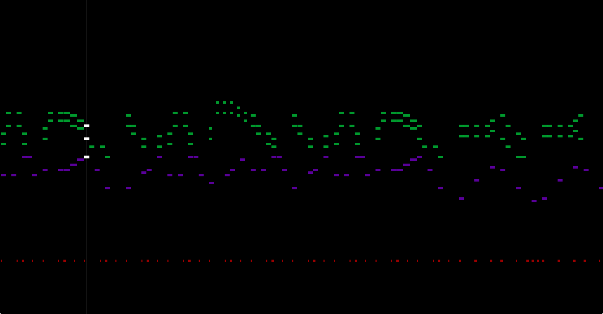
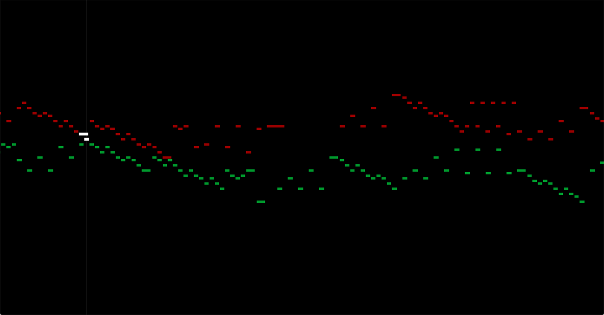

# Audio Visualization

With this program I wanted to create a program to represent different sounds. 

 

### Lessons Learned

This project taught me a lot about class decomposition and implementing arrays and maps. I learned how to store and transform data within a program. For future progress, I hope to use different audios and add features that make the visualization more intereactive.

